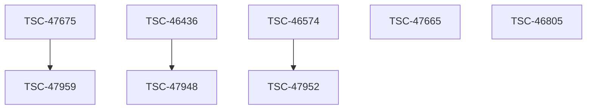

# Morning board 2026-09-28

Operator. Antonio Kotsev
Mode. WORK/FA + ANALYSIS
Jira write. NOT PERFORMED

## Sources

- `SRC-KIT` github `Py14aK/agent-workflow-kitunder`
- `SRC-XLSX-LAST` workbook-photo `morning_daily_LAST_MINUTE_2026-09-28.xlsx`
- `SRC-XLSX-VIEW` workbook-photo `morning_daily_2026-09-28_WITH_MORNING_VIEW`
- `SRC-COPILOT` copilot-video `Draft Jira updates. Not posted.`
- `SRC-PROMPTS` local-file-list-photo

## Board

| Key | Phase | Status | Clone of | Risk | Route |
|---|---|---|---|---|---|
| TSC-47959 | NEW | Under Development | TSC-47675 | A | fa-requirement-verifier |
| TSC-47948 | NEW | Under Development | TSC-46436 | A | fa-requirement-verifier |
| TSC-47952 | NEW | Under Development | TSC-46574 | A | fa-requirement-verifier |
| TSC-47665 | ACTIVE | Under Development | — | A | fa-requirement-verifier |
| TSC-47675 | CRITICAL | Bank Test | — | A | fa-requirement-verifier |
| TSC-46805 | FSD | Approved | — | B | fa-requirement-verifier |

## Clone map

## Conflicts

- `C-47675-OWNER` TSC-47675 Workbook row shows Reni Nikolova under Bank Test. Copilot morning list treats Antonio Kotsev as owner of the critical parent.

## Risk A

- TSC-47959
- TSC-47948
- TSC-47952
- TSC-47665
- TSC-47675

## Draft comments. NOT POSTED

Use the blocks generated by `orchestrate_morning.py`. Do not paste into Jira until owner conflict on TSC-47675 is resolved and live ticket text is checked.

## Checkpoints

- T+00 Inventory of keys and sources.
- T+20 Completeness. Every NEW clone has a parent.
- T+40 Trace. CDTR.AGT.NM.1 and R26_INC19789557 kept exact.
- T+60 Output. Board and drafts written. Jira untouched.

## Unverified

- Live Jira was not queried.
- Workbook cells not under Antonio were only partially readable from photos.
- Copilot drafts were not posted.
