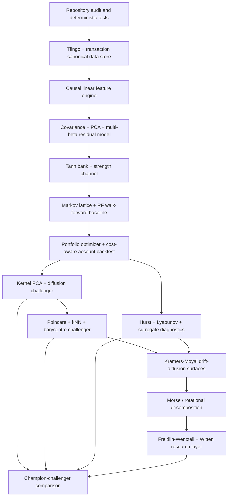

# Research Architecture for a Ten-Minute Nonlinear Portfolio Optimizer Built on Py14aK

## Executive summary

The right next step is **not** to add isolated indicators to the existing account chart. The Py14aK repository already contains pieces of a much more ambitious system: SAS hash-based moving calculations, `PROC EXPAND` moving averages and EWMA, explicit finite-state Markov propagation, bootstrap/time-series resampling, path reconstruction, `tanh`/`1-\tanh^2` nonlinear transforms, RBF-kernel ideas, velocity/acceleration notes, covariance structures, Legendre/wavelet ideas, and geometric/stochastic modeling notes. fileciteturn5file0L2-L4 fileciteturn9file0L2-L7 fileciteturn10file0L1-L2 fileciteturn14file0L2-L4

The proposed research system should therefore be built as a **layered state-space optimizer**:

\[
\boxed{
\text{10-min OHLCV}
\rightarrow
\text{causal linear state}
\rightarrow
\text{factor decomposition}
\rightarrow
\text{residual state}
\rightarrow
\text{nonlinear state}
\rightarrow
\text{regime probabilities}
\rightarrow
\text{return/risk forecasts}
\rightarrow
\text{constrained portfolio weights}
}
\]

The important methodological choice is to **preserve the linear/autocovariant structure before adding nonlinearity**. That addresses your earlier objection directly. We should not immediately throw every feature through `tanh`, PCA, a kernel, or a Poincaré ball. We should first estimate the systematic linear subspace,

\[
r_t=B F_t+\epsilon_t,
\]

and its lag structure,

\[
C_\tau
=
E[(X_t-\mu)(X_{t+\tau}-\mu)^\top],
\]

then investigate whether the residual field \(\epsilon_t\) contains stable nonlinear structure. Ledoit and Wolf's shrinkage framework is particularly relevant because the ordinary sample covariance becomes poorly conditioned when dimension is large relative to observations. citeturn0search1turn0search6

The recommended production optimizer is consequently **much more conservative than the research layer**. The production signal should combine: robust factor/residual returns, multiscale `tanh` state and magnitude, local-polynomial velocity/acceleration, volatility, causal Ichimoku, Markov-state probabilities, and a Random Forest forecast. Kernel PCA, diffusion maps, Poincaré geometry, Lyapunov analysis, Kramers–Moyal drift/diffusion, Morse potentials, Witten operators, N-body diagnostics and fractional methods should run as **challenger models**. They enter portfolio weights only after demonstrating incremental out-of-sample value over the linear baseline. Kernel PCA is explicitly a nonlinear extension of PCA through kernel eigenproblems, while diffusion maps derive coordinates from eigenfunctions of a Markov transition operator; both provide principled nonlinear baselines before adopting stronger geometric assumptions. citeturn1search16turn1search3turn1search13

The portfolio layer itself should solve something close to

\[
\boxed{
\max_w\;
\hat\mu_t^\top w
-
\frac{\lambda}{2}w^\top\hat\Sigma_t w
-
\eta\|w-w_{t-1}\|_1
-
\kappa\|B_t^\top w-b^\star\|_2^2
}
\]

subject to

\[
\mathbf1^\top w=1,
\]

position limits, gross-exposure limits, liquidity limits, optional beta constraints, and transaction-cost constraints. This preserves the mean–variance structure pioneered by Markowitz while explicitly penalizing unstable factor exposure and turnover. citeturn7search0 A parallel CVaR optimizer should be maintained as a tail-risk challenger because the Rockafellar–Uryasev formulation makes CVaR optimization tractable. citeturn7search6

Crucially, **the nonlinear research program should not presume a market manifold**. A Poincaré embedding is an empirical representation to be compared with Euclidean, Mahalanobis, kernel and diffusion distances. Nickel and Kiela introduced Poincaré embeddings specifically to exploit latent hierarchical structure; that does not establish that stock states are intrinsically hyperbolic. The market version earns negative curvature only if it improves out-of-sample neighborhood stability, state-transition prediction or portfolio results. citeturn1search5turn1search9

The complete proposed pipeline is:

```mermaid
flowchart LR
    A[Tiingo 10-min OHLCV] --> B[Cleaning / session alignment]
    B --> C[Returns + SMA EMA + volatility + Ichimoku]
    C --> D[Local causal polynomial derivatives]
    D --> E[Past-only robust scaling]

    E --> F[Linear autocovariance / covariance layer]
    F --> G[Ledoit-Wolf PCA + multi-beta factors]
    G --> H[Systematic component]
    G --> I[Residual component]

    I --> J[Multiscale tanh bank]
    I --> K[Strength / tail channel]
    J --> L[Joint nonlinear state]
    K --> L

    L --> M[Euclidean / Mahalanobis baseline]
    L --> N[Kernel PCA]
    L --> O[Diffusion maps]
    L --> P[Poincare challenger]

    M --> Q[kNN state graph]
    N --> Q
    O --> Q
    P --> Q

    Q --> R[Markov lattice]
    Q --> S[Local barycentres / N-body diagnostics]
    Q --> T[Drift-diffusion / Kramers-Moyal]
    Q --> U[Lyapunov / Hurst diagnostics]

    R --> V[RF + state probability ensemble]
    S --> V
    T --> V
    U --> V

    V --> W[Expected return / risk forecasts]
    F --> W
    W --> X[Constrained portfolio optimizer]
    X --> Y[Cash-flow-adjusted walk-forward backtest]
    Y --> Z[Research report + charts + CSV outputs]
```



The data pipeline can use Tiingo's current consolidated equity intraday endpoint where available; Tiingo documents historical intraday OHLCV with configurable minute resampling and describes that consolidated feed as drawing from multiple equity venues. Its IEX historical endpoint is suitable as a fallback/check, but Tiingo notes that IEX historical volume is IEX-only. citeturn0search5turn0search0

## Repository and data foundation

The existing repository should be treated as the **research ancestor**, not discarded.

`Risk/Moving averages` already demonstrates two useful patterns: a SAS hash lookup around dates and `PROC EXPAND` calculations for simple, weighted and exponentially weighted averages; the explicit EWMA alpha in that artifact is `0.37`, while the WMA uses a long custom weight sequence. fileciteturn5file0L2-L4 The translated Python module says it consolidates the repository's bootstrap, fair-coin Markov, moving-average, moving-block bootstrap, and hash/path logic, and implements `compute_moving_averages`, autoregressive block bootstrap and path reconstruction functions. fileciteturn9file0L2-L7

The `Fair coins` artifact is particularly relevant to the proposed state lattice: it explicitly defines rows as current states, columns as next states, propagates a state distribution by multiplying it by \(P\), and repeatedly computes

\[
s_{t+1}=s_tP.
\]

fileciteturn14file0L2-L4 That mechanism maps almost directly to a market regime matrix once empirical transition probabilities replace coin-transition probabilities.

The `Dynamic Geometric Spaces` notes contain the ideas that now need to be made falsifiable: `tanh`, the derivative \(1-f^2\), `sech(wavelet)`, phase and group velocity, a Legendre differential equation, covariance dynamics, RBF kernels, cluster analysis, geometric modeling, HMM/ARIMAX, velocity and acceleration formulas, and path/geometric hypotheses. fileciteturn10file0L1-L2 The correct research response is not to accept all of those physical analogies; it is to translate each into an empirical statistic with a null model.

**Data schema.** Each raw 10-minute record should contain at minimum

```text
ticker
datetime_utc
datetime_exchange
session_date
open
high
low
close
volume
```

with optional bid/ask or Tiingo liquidity-reference fields when available. Tiingo's current consolidated intraday documentation describes historical intraday OHLCV with minute/hour resampling and liquidity/reference metrics, while its IEX documentation separately describes historical OHLC and IEX-specific volume. citeturn0search5turn0search0

Do **not** restrict estimation history to the one month that is plotted. A normal U.S. regular session has only a few dozen 10-minute observations per day, so covariance, nonlinear state transitions, RF training and diffusion estimation need substantially more historical observations than the display interval. The report can remain one month while the fit window uses much longer history. This follows directly from the high-dimensional estimation problem that motivates covariance shrinkage. citeturn0search1

A canonical panel should be indexed as

\[
X[t,i,f],
\]

where \(t\) is a 10-minute timestamp, \(i\) is a stock, and \(f\) is a feature.

Missing bars should not automatically be force-filled for statistical estimation. A synthetic zero return can create false autocorrelation and correlation. Maintain both a raw activity mask

\[
A_{i,t}\in\{0,1\}
\]

and an aligned analytical matrix. This is especially important at high frequency because Epps showed that measured stock comovement changes materially as the sampling interval shortens, and subsequent work has identified asynchronous observations as an important contributor. citeturn4search13turn0academia48

The initial repository structure should become:

```text
Py14aK/
├── sas/
│   ├── moving_averages.sas
│   ├── ichimoku.sas
│   ├── markov_lattice.sas
│   └── validation_freq.sas
├── src/
│   ├── data/
│   │   ├── tiingo.py
│   │   ├── sessions.py
│   │   └── transactions.py
│   ├── features/
│   │   ├── linear.py
│   │   ├── tanh_bank.py
│   │   ├── derivatives.py
│   │   ├── volatility.py
│   │   └── ichimoku.py
│   ├── risk/
│   │   ├── covariance.py
│   │   ├── factors.py
│   │   └── residuals.py
│   ├── geometry/
│   │   ├── kernel.py
│   │   ├── diffusion.py
│   │   ├── poincare.py
│   │   └── neighbours.py
│   ├── dynamics/
│   │   ├── markov.py
│   │   ├── lyapunov.py
│   │   ├── fractional.py
│   │   ├── kramers_moyal.py
│   │   └── morse.py
│   ├── models/
│   │   ├── random_forest.py
│   │   ├── woe_iv.py
│   │   └── ensemble.py
│   ├── portfolio/
│   │   ├── optimize.py
│   │   ├── costs.py
│   │   └── backtest.py
│   └── reporting/
│       └── charts.py
├── notebooks/
│   ├── feature_audit.ipynb
│   ├── factor_geometry.ipynb
│   ├── stochastic_surface.ipynb
│   └── portfolio_walkforward.ipynb
└── outputs/
```

A reproducible local ingestion command should look like:

```bash
export TIINGO_API_KEY="YOUR_LOCAL_TOKEN"

python -m src.data.tiingo \
  --universe config/universe.csv \
  --bar-size 10min \
  --start 2025-01-01 \
  --end 2026-08-24 \
  --output data/ohlcv_10min.parquet
```

Tiingo requires a token for API access and currently documents both historical IEX and consolidated intraday endpoints. citeturn0search0turn0search5turn0search18

## Feature and state engine

The feature engine should explicitly implement your idea of **linear/autocovariant structure first, nonlinearity second**.

Let

\[
r_{i,t}
=
\log P_{i,t}-\log P_{i,t-1}.
\]

Construct multiscale returns,

\[
r_{i,t}^{(h)}
=
\log P_{i,t}
-
\log P_{i,t-h},
\]

for candidate horizons

\[
h\in\{1,3,6,9,13,26,39,52,78\}.
\]

On 10-minute observations these span immediate motion through intraday and multi-session structures.

The first state is **not nonlinear**:

\[
X_{i,t}^{L}
=
[
r^{(1)},
r^{(3)},
r^{(6)},
SMA,
EMA,
v,
a,
\sigma,
\text{range},
\text{volume},
\text{Ichimoku}
].
\]

SMA and EMA should be retained because they are interpretable low-pass filters and because the repository already has both SAS and Python implementations. fileciteturn5file0L2-L4 fileciteturn9file0L2-L7

For derivative-like information, use **causal local polynomial fits**, not naïve second differences. Savitzky and Golay's original method estimates smoothed values and derivatives through local least-squares polynomial procedures. citeturn4search0 For trading, however, the ordinary centered filter must be modified to use only information available at \(t\).

Fit on the trailing window:

\[
x(t-k)
\approx
a_0+a_1(-k\Delta t)+a_2(-k\Delta t)^2+a_3(-k\Delta t)^3.
\]

Then

\[
v_t=a_1,\qquad
a_t=2a_2,\qquad
j_t=6a_3.
\]

Candidate settings:

| Feature | Parameter grid | Purpose | Complexity per series | Principal failure |
|---|---|---|---:|---|
| SMA | 3, 6, 9, 13, 26, 39, 52 | slow/fast level | \(O(T)\) with rolling sums | lag |
| EMA | half-life 3, 6, 13, 39, 195 bars | adaptive trend | \(O(T)\) | arbitrary decay |
| Local polynomial | trailing 7, 9, 13, 21; degree 2–3 | velocity/acceleration | \(O(Twp^2)\), reducible with fixed filter coefficients | derivative noise, edge bias |
| Realized volatility | 6, 13, 39, 78, 195 | local risk | \(O(T)\) | jumps/microstructure contamination |
| Ichimoku | 9/26/52 | range equilibrium/state | \(O(T)\) with rolling extrema | displaced plotting values can cause leakage |
| FFT/wavelet | window 128–1024 bars | scale diagnostics | FFT \(O(T\log T)\) | nonstationarity/leakage |
| Fractional features | rolling long-memory windows | persistent memory | implementation dependent | spurious \(H\) from regime changes |

The FFT is computationally real—Cooley and Tukey's algorithm reduced Fourier-series calculation to the now-familiar fast transform structure—but frequencies should be interpreted as observed time scales rather than literal market wavelengths. citeturn4search7turn4search19 Wavelets are the stronger multiscale challenger because Mallat's framework explicitly constructs resolution-dependent representations through translated and dilated bases. citeturn8search0

**Normalization must be causal.** For each continuous feature \(x_{i,t}\), fit robust scale from past observations only:

\[
z_{i,t}
=
\frac{x_{i,t}-\operatorname{median}_{\mathcal W_t}(x_i)}
{1.4826\,MAD_{\mathcal W_t}(x_i)+\epsilon}.
\]

Maintain two normalizations rather than conflating them:

\[
z^{TS}_{i,t}
\]

for a stock's own historical state, and

\[
z^{XS}_{i,t}
\]

for its contemporaneous cross-sectional state relative to other stocks.

That distinction is important. A stock can be extreme relative to itself but ordinary relative to the market.

**The `tanh` bank should be explicitly dual-channel.** For each normalized input \(z\),

\[
S_\beta(z)=\tanh(\beta z),
\]

with

\[
\beta\in\{0.25,0.5,1,2,4\}.
\]

Large \(\beta\) approximates a soft sign and therefore highlights persistent \(+/-\) pattern agreement. Small \(\beta\) retains substantially more amplitude sensitivity.

At the same time preserve strength:

\[
M(z)
=
\operatorname{sign}(z)\log(1+|z|)
\]

or simply the robust \(z\) itself.

Add

\[
G_\beta
=
\frac{\partial S_\beta}{\partial z}
=
\beta(1-S_\beta^2),
\]

plus

\[
\Delta S_\beta,\qquad
\Delta M.
\]

This directly fixes the loss you identified in the older `tanh` construction: **state synchronization and strength synchronization become separate quantities**. The repository's geometric notes explicitly contain the `tanh` derivative \(1-f^2\), making this an extension rather than a replacement of the original idea. fileciteturn10file0L1-L2

The nonlinear feature map is therefore

\[
\boxed{
\Phi_i(t)=
[
S_{0.25},
S_{0.5},
S_1,
S_2,
S_4,
M,
G_{0.25},\ldots,G_4,
\Delta S,
\Delta M
].
}
\]

Then compute not only ordinary covariance but a multiscale nonlinear cross-covariance:

\[
C_{ij}^{ab}
=
\operatorname{Cov}
[
S_{\beta_a,i},
S_{\beta_b,j}
],
\]

and the lagged version

\[
\Gamma_{ij}^{ab}(\ell)
=
\operatorname{Cov}
[
S_{\beta_a,i,t},
S_{\beta_b,j,t+\ell}
].
\]

This is especially relevant at 10-minute frequency because zero-lag correlation can decline or shift with sampling interval and lead/lag structure; the original Epps result found decreasing short-interval comovement, and later studies explicitly analyzed asynchronous effects. citeturn4search13turn0academia48

A compact implementation:

```python
import numpy as np
import pandas as pd

BETAS = np.array([0.25, 0.5, 1.0, 2.0, 4.0])

def rolling_robust_z(
    s: pd.Series,
    window: int = 390,
    min_periods: int = 78,
) -> pd.Series:
    """Past-only rolling robust z-score."""
    med = s.shift(1).rolling(window, min_periods=min_periods).median()
    mad = (
        (s.shift(1) - med)
        .abs()
        .rolling(window, min_periods=min_periods)
        .median()
    )
    return (s - med) / (1.4826 * mad + 1e-12)


def tanh_bank(z: pd.Series) -> pd.DataFrame:
    x = z.to_numpy(dtype=float)
    out = {}

    for beta in BETAS:
        s = np.tanh(beta * x)
        out[f"tanh_{beta:g}"] = s
        out[f"sensitivity_{beta:g}"] = beta * (1.0 - s * s)
        out[f"dtanh_{beta:g}"] = pd.Series(s, index=z.index).diff().to_numpy()

    # Parallel magnitude channel prevents saturation from erasing strength.
    out["strength"] = np.sign(x) * np.log1p(np.abs(x))
    out["dstrength"] = pd.Series(out["strength"], index=z.index).diff().to_numpy()

    return pd.DataFrame(out, index=z.index)
```

For Ichimoku, use the supplied 9/26/52 rolling maxima/minima, but enforce a strict distinction between a **plot displacement** and a **predictor**. A Chikou value requiring future close when aligned on today's timestamp cannot enter a causal forecast. Similarly, the cloud that affects today's decision must be the cloud calculable from information available by today.

The first feature deliverable should therefore be:

```text
outputs/features_10min.parquet
outputs/feature_dictionary.csv
outputs/feature_missingness.csv
outputs/feature_autocovariance.csv
outputs/tanh_covariance_tensor.npz
```

with a synchronized state chart containing price/account return, SMA/EMA, velocity, acceleration, volatility, Ichimoku state, tanh state and strength.

## Dependence geometry, covariance and embeddings

The linear dependence layer is the anchor of the whole project.

Let

\[
R_t=(r_{1,t},\ldots,r_{N,t})^\top.
\]

Estimate three covariance matrices concurrently.

The rolling sample estimator is

\[
\hat\Sigma_t^{roll}
=
\frac{1}{W-1}
\sum_{s=t-W+1}^{t}
(R_s-\bar R)(R_s-\bar R)^\top.
\]

EWMA uses

\[
\hat\Sigma_t^{EWMA}
=
\lambda\hat\Sigma_{t-1}^{EWMA}
+
(1-\lambda)
(R_t-\mu_t)(R_t-\mu_t)^\top.
\]

Rather than hard-coding arbitrary \(\lambda\), specify half-life \(h\):

\[
\lambda
=
2^{-1/h}.
\]

Test

\[
h\in
\{39,195,780\}
\]

bars, roughly corresponding to increasingly slow intraday/multi-session regimes.

Ledoit–Wolf shrinkage uses a convex combination between the sample covariance and a structured target. Ledoit and Wolf developed the estimator to improve conditioning and accuracy when the dimension is large relative to available observations. citeturn0search1turn0search6

| Covariance method | Hyperparameters | Update cost | Robustness | Portfolio role |
|---|---|---:|---|---|
| Rolling sample | \(W=195,390,780,1560\) | \(O(N^2)\) incremental | Low–medium | diagnostic |
| EWMA | half-life 39,195,780 | \(O(N^2)\) | Medium | fast regime risk |
| Ledoit–Wolf | estimated shrinkage | \(O(TN^2)\) fit | High relative to raw sample | primary optimization matrix |
| Nonlinear Ledoit–Wolf challenger | bandwidth/eigen corrections | higher | potentially high in high-dimensional setting | research |
| Factor covariance | factor count \(K\) | \(O(TNK+K^3)\) | high if factors stable | large universe |

The nonlinear shrinkage literature extends linear shrinkage by transforming sample eigenvalues nonlinearly, and Ledoit and Wolf report improvements over both raw and linear-shrinkage estimators in their asymptotic/Monte Carlo framework. citeturn0search13

Next perform eigendecomposition:

\[
\hat\Sigma_t
=
V_t\Lambda_tV_t^\top.
\]

Choose \(K\) with a combination of explained variance, cross-validation and eigenvalue stability rather than a fixed percentage alone.

The factor representation is

\[
F_t
=
V_K^\top R_t.
\]

For each stock:

\[
r_{i,t}
=
\alpha_i
+
\sum_{k=1}^K
\beta_{ik}F_{k,t}
+
\epsilon_{i,t}.
\]

The critical object is

\[
\boxed{\epsilon_{i,t}},
\]

because it separates common linear motion from stock-specific/residual structure.

The portfolio beta vector is

\[
\beta_p
=
B^\top w.
\]

This enables explicit decisions such as

\[
B^\top w=0
\]

for selected factor-neutral portfolios, rather than confusing “non-beta” with “non-Euclidean.”

A particularly useful extension of your “autocovariant first” idea is the lagged generalized eigenproblem

\[
C_\tau v
=
\lambda C_0v,
\]

where

\[
C_0=E[X_tX_t^\top],\qquad
C_\tau=E[X_tX_{t+\tau}^\top].
\]

Those vectors isolate linear directions that remain coherent through time rather than merely explaining instantaneous variance. Compare them with ordinary PCA factors before entering a nonlinear model.

**Reverse-correlated securities** should be discovered after factor stripping. Rank candidates using

\[
\rho_{ij}^{raw},
\qquad
\rho_{ij}^{residual},
\qquad
\rho_{ij}^{partial},
\]

plus lagged correlations

\[
\rho_{ij}(\ell).
\]

A candidate hedge that looks unrelated in raw correlation but strongly negatively correlated in \(\epsilon\)-space can be more interesting than a security chosen manually because it belongs to the same named sector.

Then establish nonlinear baselines.

Kernel PCA applies ordinary PCA in an implicit feature space defined by a kernel; Schölkopf, Smola and Müller formulated this as a kernel eigenvalue problem. citeturn1search16

For an RBF kernel,

\[
K_{ab}
=
\exp
\left(
-\gamma
\|\Phi(X_a)-\Phi(X_b)\|^2
\right).
\]

Test

\[
\gamma
\in
\left\{
\frac{0.25}{m_d^2},
\frac{0.5}{m_d^2},
\frac1{m_d^2},
\frac2{m_d^2}
\right\},
\]

where \(m_d\) is a robust median pairwise distance. This avoids meaningless absolute \(\gamma\) values after feature-scale changes.

Diffusion maps should be the next challenger. Coifman and Lafon's formulation builds a Markov matrix from local similarities and uses its eigenfunctions as coordinates, producing multiscale diffusion distances. citeturn1search3turn1search13 For market states, that is conceptually attractive because it asks whether two states are connected through many high-probability local paths, not just whether their coordinate vectors are close.

The Poincaré pipeline comes only after those baselines.

Given a low-dimensional vector

\[
z\in\mathbb R^d,
\]

map from the tangent space at the origin into curvature \(-c\) Poincaré space:

\[
\boxed{
y=
\exp_0^c(z)
=
\tanh(\sqrt c\|z\|)
\frac{z}
{\sqrt c\|z\|}
}
\]

with \(y=0\) at \(z=0\).

Then

\[
\|y\|<1/\sqrt c.
\]

Distance can be written through Möbius addition as

\[
d_c(x,y)
=
\frac{2}{\sqrt c}
\operatorname{artanh}
\left(
\sqrt c\,\|-x\oplus_c y\|
\right).
\]

But this deterministic exponential map **does not prove anything is hyperbolic**. Nickel and Kiela's Poincaré method was designed to learn hierarchical representations via Riemannian optimization; our market hypothesis must be validated against Euclidean alternatives. citeturn1search5turn1search9

Test curvature

\[
c\in\{0.01,0.1,0.5,1,2,5\}.
\]

Select it entirely inside training/validation windows using:

\[
\text{kNN Jaccard stability},
\]

\[
\text{next-state log loss},
\]

\[
\text{forward residual-return rank IC},
\]

and eventual portfolio utility.

For each stock \(i\), find

\[
N_k(i,t),
\qquad
k\in\{5,8,12,16\}.
\]

Your original \(k=8\) becomes an explicit candidate, not a sacred constant.

The “gravity center” becomes a weighted Fréchet mean:

\[
\boxed{
m_i(t)
=
\arg\min_z
\sum_{j\in N_k(i,t)}
w_jd^2(z,y_j(t)).
}
\]

Use three mass definitions as challengers:

\[
w_j=1/k,
\]

\[
w_j\propto1/\hat\sigma_{\epsilon,j}^2,
\]

and

\[
w_j\propto |w_j^{portfolio}|.
\]

Then calculate

\[
D_i(t)=d(y_i(t),m_i(t)),
\]

\[
\Delta D_i(t),
\]

and local dispersion

\[
R_i^2(t)
=
\frac{\sum_jw_jd^2(y_j,m_i)}
{\sum_jw_j}.
\]

Those are defensible “N-body” statistics.

Literal Newtonian gravity should remain an optional diagnostic:

\[
U(t)=
-\sum_{i<j}
\frac{Gm_im_j}
{\sqrt{d_{ij}^2+\varepsilon^2}},
\]

because the market supplies no conservation law that justifies a physical \(1/r\) force. A more statistically defensible N-body feature is the pair-distance spectrum, local simplex volume, neighborhood radius, graph energy, neighbor turnover and covariance log-determinant.

| Representation | Main parameter | Approximate scaling | Robustness expectation | Gate to production |
|---|---|---:|---|---|
| PCA | \(K\) | \(O(TN^2+N^3)\) | high baseline | required |
| Lagged covariance subspace | \(\tau,K\) | \(O(Tp^2+p^3)\) | medium–high | required challenger |
| RBF kernel PCA | \(\gamma,m\) samples | \(O(m^2p+m^3)\) exact | medium | incremental OOS value |
| Diffusion maps | bandwidth, neighbors | sparse \(O(mk)\) graph + eigensolve | medium–high if local structure real | stable diffusion spectrum |
| Poincaré | \(c,d\) | distance \(O(md)\); learning more costly | unknown | must beat Euclidean/Mahalanobis |
| kNN | \(k\) | brute \(O(mNd)\), indexed lower in favorable dimensions | medium | neighbor stability |
| Fréchet mean | iterations, weights | \(O(kdI)\) locally | medium | stable center |
| N-body diagnostics | neighborhood size | \(O(k^2d)\) local / \(O(N^2d)\) global | exploratory | regime value OOS |

The principal geometry charts are:

```text
corr_rolling_heatmap.png
corr_ewma_heatmap.png
corr_ledoitwolf_heatmap.png
pca_eigenvalue_timeline.png
pca_loading_heatmap.png
residual_corr_heatmap.png
kernel_pca_2d.png
diffusion_map_2d.png
poincare_2d.html
poincare_3d.html
knn_neighbour_turnover.png
local_barycentre_distance.png
nbody_dispersion.png
```

No Poincaré chart should be labelled “market manifold.” The correct label is **hyperbolic state embedding challenger**.

## Stochastic dynamics, Markov structure and nonlinear regime tests

The `PROC FREQ` idea should become the simplest forward stochastic model in the stack.

Start with a deliberately small state lattice. For example:

\[
S_t
=
(
q_{\text{tanh}},
q_{\text{strength}},
q_{\sigma}
),
\]

where each coordinate has three bins:

\[
\{-1,0,+1\}.
\]

This creates at most

\[
3^3=27
\]

states.

Estimate

\[
N_{ij}
=
\sum_t
1(S_t=i,S_{t+1}=j),
\]

and

\[
P_{ij}
=
\frac{N_{ij}+\alpha}
{\sum_jN_{ij}+K\alpha}.
\]

Use a small Dirichlet pseudocount such as

\[
\alpha\in\{0.1,0.5,1\}
\]

to avoid impossible zero-probability transitions.

Python analogue:

```python
def transition_matrix(df, state_col="state"):
    x = df.sort_values(["ticker", "datetime"]).copy()
    x["next_state"] = x.groupby("ticker")[state_col].shift(-1)
    x = x.dropna(subset=["next_state"])

    counts = pd.crosstab(x[state_col], x["next_state"])
    counts = counts.astype(float)

    alpha = 0.5
    counts += alpha

    P = counts.div(counts.sum(axis=1), axis=0)
    return counts, P
```

SAS analogue:

```sas
proc sort data=work.states out=work.states_desc;
    by ticker descending datetime;
run;

/* In descending time, LAG(state) is the chronological next state. */
data work.transitions;
    set work.states_desc;
    by ticker;
    next_state = lag(state);
    if first.ticker then next_state = .;
    if not missing(next_state);
run;

proc freq data=work.transitions noprint;
    tables state * next_state / out=work.transition_counts;
run;
```

The existing Py14aK `Fair coins` program already demonstrates explicit transition matrices and repeated propagation \(s_{t+1}=s_tP\), while `risk_translated.py` includes a Python translation of that logic. fileciteturn14file0L2-L4 fileciteturn9file0L2-L7

Forward distributions are

\[
\pi_{t+h}=\pi_tP^h.
\]

The transition graph should store on each node:

\[
\text{occupancy},
\quad
E[r_{t+h}\mid S_t],
\quad
\sigma[r_{t+h}\mid S_t],
\quad
P(r_{t+h}>c\mid S_t),
\]

and on each edge:

\[
P_{ij}.
\]

The requested “boxes/pixels” visualization then becomes precise: cell area is occupancy, cell shade is conditional forward return, uncertainty controls outline/opacity, and transition probability determines edge width.

**Hurst and fractional differencing.** Mandelbrot and Van Ness formalized fractional Brownian motion and fractional noise, while Granger and Joyeux introduced fractional differencing via the expansion of \((1-B)^d\) for long-memory time-series models. citeturn2search3turn5search0 Geweke and Porter-Hudak subsequently proposed a low-frequency log-periodogram estimator for the long-memory parameter. citeturn5search2

Test Hurst/memory on returns, absolute returns, squared returns, residual returns and volatility separately. Do **not** infer that \(H>1/2\) automatically gives a tradeable price trend.

Fractional differencing is

\[
(1-L)^dx_t
=
\sum_{k=0}^{\infty}
(-1)^k
{d\choose k}
x_{t-k}.
\]

Test

\[
d\in
\{0,0.1,0.2,\ldots,0.9\}
\]

inside each training fold and choose the smallest \(d\) that materially improves stationarity while preserving signal stability. The original Granger–Joyeux formulation is specifically an infinite fractional filter, which is why truncation error and low-frequency behavior must be monitored. citeturn5search0

**Chaos diagnostics require hostile null tests.** Rosenstein, Collins and De Luca proposed estimating the largest Lyapunov exponent from divergence of nearby reconstructed trajectories. citeturn1search0turn1search11 For a scalar regime series \(x_t\), form delay vectors

\[
X_t=
(x_t,x_{t-\tau},\ldots,x_{t-(m-1)\tau})
\]

and estimate

\[
\lambda
\approx
\frac{d}{dt}
E[
\log d(X_t,X_t^\text{neighbor})
].
\]

Test candidate

\[
m\in\{3,4,5,6,8\},
\qquad
\tau
\]

from autocorrelation or mutual-information scales.

But a positive estimated Lyapunov slope is **not sufficient evidence of deterministic chaos** in financial data. Repeat the same estimator on:

1. shuffled returns;
2. phase-randomized surrogates;
3. Gaussian correlated Brownian simulations;
4. fitted stochastic-volatility/GARCH-like simulations;
5. block-bootstrap data.

The existing Py14aK translation already contains moving-block bootstrap machinery, making this null-testing program particularly natural. fileciteturn9file0L2-L7

**Kramers–Moyal/stochastic surface estimation** is one of the more interesting research branches because it can be stated without pretending the raw path is differentiable.

For low-dimensional state \(X_t\),

\[
D_i^{(1)}(x)
=
\lim_{\Delta t\to0}
\frac{
E[\Delta X_i\mid X_t=x]
}{\Delta t},
\]

and

\[
D_{ij}^{(2)}(x)
=
\frac12
\lim_{\Delta t\to0}
\frac{
E[\Delta X_i\Delta X_j\mid X_t=x]
}{\Delta t}.
\]

A recent APS study reconstructs multivariate Langevin drift and diffusion nonparametrically through Kramers–Moyal coefficients and demonstrates the framework on financial-market examples; earlier finance-oriented Langevin work likewise estimated financial potential structures. citeturn8search1turn8search2

Estimate those fields with local-kernel regression in **two or three dimensions first**. High-dimensional Kramers–Moyal estimation will suffer severe sample sparsity.

The resulting stochastic model is

\[
dX_t
=
b(X_t)\,dt
+
\sigma(X_t)\,dW_t,
\]

with

\[
b=D^{(1)},
\qquad
a=\sigma\sigma^\top=2D^{(2)}.
\]

The associated Fokker–Planck form is

\[
\frac{\partial p}{\partial t}
=
-\sum_i
\partial_i(b_ip)
+
\frac12
\sum_{ij}
\partial_i\partial_j(a_{ij}p).
\]

This produces the requested **Brownian/stochastic surfaces**:

```text
drift_surface_D1.html
diffusion_surface_D2.html
conditional_density_surface.html
probability_current_surface.html
```

The next question is whether the drift is approximately gradient-like.

Fit

\[
b(x)
=
-\nabla_gV(x)
+
r(x).
\]

Estimate \(V\) by minimizing, over a smooth basis,

\[
\sum_n
\left\|
b(x_n)+g^{-1}(x_n)\nabla V(x_n)
\right\|^2
+
\lambda_V\mathcal R[V].
\]

The residual

\[
r(x)
\]

is the non-gradient/rotational component.

A still safer discrete version uses the kNN graph and performs a **graph Hodge decomposition** of edge flows into gradient and cyclic components. That avoids claiming a smooth manifold before the data justify one.

Only after this stage should we invoke Morse structure.

A smooth estimated \(V\) has a candidate critical point where

\[
\nabla V(x^\star)=0.
\]

Calculate

\[
H_V(x^\star)
=
\nabla^2V(x^\star).
\]

A candidate Morse critical point must be nondegenerate:

\[
\det H_V(x^\star)\neq0.
\]

Its index is the number of negative Hessian eigenvalues.

Bootstrap these critical points across historical windows. A “market basin” that disappears under tiny changes of the sample should not be interpreted as a metastable regime.

Witten's 1982 construction connects Morse theory with a supersymmetric deformation of differential operators and relates low-lying structure to critical points of a Morse function. citeturn9view0turn0search15 The optional research operator is

\[
d_\tau
=
e^{-\tau V}d\,e^{\tau V}
=
d+\tau\,dV\wedge,
\]

with Witten Laplacian

\[
\Delta_\tau
=
d_\tau d_\tau^\dagger
+
d_\tau^\dagger d_\tau.
\]

This should **not** be a trading indicator. Its legitimate use here is as a metastability/topological challenger after a reproducible potential \(V\) has been estimated.

For rare state transitions, the appropriate link is Freidlin–Wentzell large-deviation theory. Their monograph explicitly develops the action functional for randomly perturbed dynamical systems. citeturn3search0turn3search2 For nonsingular diffusion,

\[
S[\phi]
=
\frac12
\int
(\dot\phi-b(\phi))^\top
a(\phi)^{-1}
(\dot\phi-b(\phi))
\,dt.
\]

Minimum-action paths between stable regimes become the rigorous version of the “instanton” idea.

The stochastic/chaos component comparison is:

| Method | Primary use | Parameters | Scaling | Main failure mode |
|---|---|---|---:|---|
| Markov lattice | discrete forward state | bins, \(\alpha\), horizon | \(O(T)\) | state explosion/nonstationarity |
| Hurst/GP-H | long memory | frequency range/window | near \(O(T\log T)\) | trends mimic memory |
| Fractional differencing | memory-preserving stationarity | \(d\), truncation | \(O(TL)\) | over-differencing |
| Rosenstein LLE | trajectory divergence | \(m,\tau,\) Theiler window | naive \(O(T^2)\) | stochastic noise mimics chaos |
| Kramers–Moyal | drift/diffusion surfaces | bandwidth, dimension | \(O(Tq)\) local or worse | curse of dimensionality |
| Gradient/rotational decomposition | equilibrium vs current | basis, regularization | basis-dependent | nonidentifiability |
| Morse analysis | stable points/saddles | smooth \(V\) | Hessian/basis dependent | unstable fake critical points |
| Freidlin–Wentzell | rare transition path | estimated \(b,a\) | numerically intensive | poor small-noise assumption |
| Witten layer | metastability/topology research | \(\tau,V\) | high | unjustified geometry/potential |

The key evaluation metric here is **stability**, not visual beauty:

\[
\text{ID-stability}
=
\operatorname{CV}
[
\hat d_{\mathrm{intrinsic}}(t)
],
\]

plus critical-point bootstrap persistence, neighbor Jaccard stability, diffusion-eigenvalue stability and Markov transition drift.

## Predictive models, portfolio optimization and backtesting

The predictive layer should be deliberately simpler than the feature layer.

The principal supervised targets should be residual returns rather than raw returns:

\[
y_{i,t}^{(h)}
=
\sum_{j=1}^{h}
\epsilon_{i,t+j},
\]

and a cost-adjusted binary target:

\[
Y_{i,t}^{(h)}
=
1[
y_{i,t}^{(h)}>c_{i,t}^{trade}
].
\]

Test

\[
h\in\{3,6,13,39\}
\]

bars.

This prevents the RF from “predicting” a market beta that could have been handled transparently in the factor layer.

Random Forests are an appropriate nonlinear challenger because Breiman's construction combines randomized tree predictors and was explicitly designed to reduce the instability of individual trees through ensemble averaging. citeturn2search0

Candidate RF grid:

| Parameter | Grid |
|---|---|
| `n_estimators` | 500, 1000, 2000 |
| `max_depth` | 3, 5, 8, 12, None |
| `min_samples_leaf` | 20, 50, 100, 200 |
| `max_features` | `sqrt`, 0.3, 0.5, 0.7 |
| target horizon | 3, 6, 13, 39 bars |
| training lookback | 60, 120, 250 sessions |
| gap/embargo | at least forecast horizon |

The inner RF bootstrap should be treated carefully because adjacent 10-minute rows are dependent. Compare ordinary tree bootstrap against block/subsample variants informed by the repository's moving-block bootstrap functions. fileciteturn9file0L2-L7

The walk-forward structure is:

\[
\boxed{
\text{train}
\rightarrow
\text{validation}
\rightarrow
\text{gap}
\rightarrow
\text{test}
}
\]

and every scaler, binning rule, PCA basis, covariance matrix, kernel bandwidth, Poincaré curvature, state definition and RF parameter is fit **inside the training segment**.

Overlapping forward-return labels require a gap at least as long as \(h\). Otherwise adjacent train/test observations share future prices.

WoE and Information Value should remain **screening diagnostics**, not the optimizer.

For bin \(b\),

\[
WoE_b
=
\log
\frac{
P(X\in b\mid Y=1)
}{
P(X\in b\mid Y=0)
}.
\]

Then

\[
IV
=
\sum_b
\left[
P(X\in b\mid Y=1)
-
P(X\in b\mid Y=0)
\right]
WoE_b.
\]

Fit bins on training data, freeze them, and compute

\[
IV_{\text{train}},
\qquad
IV_{\text{validation}},
\qquad
IV_{\text{OOS}}.
\]

Do not rely on conventional generic “IV > X is good” scorecard rules. The useful statistic here is stability:

\[
\text{IV stability}
=
\frac{
IV_{OOS}
}{
IV_{train}+\epsilon
}
\]

along with preservation of WoE ordering/sign.

The feature gate should require at minimum one of:

\[
\text{OOS IV stability},
\]

\[
\text{permutation importance stability},
\]

\[
\text{OOS rank correlation},
\]

\[
\text{incremental log-loss reduction}.
\]

The model ensemble then produces

\[
\hat\mu_{i,t}.
\]

I would combine estimates conservatively:

\[
\hat\mu
=
\omega_M\hat\mu^{Markov}
+
\omega_{RF}\hat\mu^{RF}
+
\omega_K\hat\mu^{kernel}
+
\omega_D\hat\mu^{diffusion},
\]

with

\[
\omega_j\ge0,\qquad
\sum_j\omega_j=1,
\]

and then shrink toward zero:

\[
\boxed{
\tilde\mu
=
\rho\hat\mu,
\qquad
\rho\in[0,1].
}
\]

The shrinkage \(\rho\) is selected by walk-forward portfolio performance; estimated returns are substantially less statistically stable than covariance and should not be allowed to overpower the risk model.

The production optimizer is:

\[
\max_w
\left[
\tilde\mu_t^\top w
-
\frac{\lambda}{2}
w^\top\hat\Sigma_t^{LW}w
-
\eta\|w-w_{t-1}\|_1
-
\kappa
\|B_t^\top w-b^\star\|_2^2
\right].
\]

Markowitz's original formulation established the expected-return/variance portfolio framework. citeturn7search0 Here the additions explicitly address modern implementation problems: turnover, factor exposures and unstable forecasts.

Constraints:

\[
\mathbf1^\top w=1,
\]

\[
l_i\le w_i\le u_i,
\]

\[
\|w\|_1\le L,
\]

\[
|B^\top w-b^\star|\le\delta,
\]

\[
|\Delta w_i|
\le
\text{liquidity limit}_i.
\]

For long-only research:

\[
0\le w_i\le 0.10
\]

is a reasonable **grid candidate**, not a universal recommendation.

For a market-neutral experiment:

\[
\mathbf1^\top w=0,
\qquad
\|w\|_1=1,
\qquad
\beta_p\approx0.
\]

A CVaR challenger should minimize

\[
\operatorname{CVaR}_\alpha(L)
\]

at

\[
\alpha\in\{0.95,0.975,0.99\}.
\]

Rockafellar and Uryasev's formulation is the relevant optimization foundation. citeturn7search6

A compact Python objective:

```python
import cvxpy as cp
import numpy as np

def optimize_portfolio(
    mu: np.ndarray,
    cov: np.ndarray,
    w_prev: np.ndarray,
    betas: np.ndarray | None = None,
    target_beta: np.ndarray | None = None,
    risk_aversion: float = 10.0,
    turnover_penalty: float = 0.002,
    factor_penalty: float = 5.0,
    max_weight: float = 0.10,
):
    n = len(mu)
    w = cp.Variable(n)

    objective = (
        mu @ w
        - 0.5 * risk_aversion * cp.quad_form(w, cov)
        - turnover_penalty * cp.norm1(w - w_prev)
    )

    if betas is not None and target_beta is not None:
        objective -= factor_penalty * cp.sum_squares(
            betas.T @ w - target_beta
        )

    constraints = [
        cp.sum(w) == 1,
        w >= 0,
        w <= max_weight,
    ]

    problem = cp.Problem(cp.Maximize(objective), constraints)
    problem.solve()

    if w.value is None:
        raise RuntimeError(f"Optimization failed: {problem.status}")

    return np.asarray(w.value).ravel()
```

**Backtesting must be account-aware.** Let \(V_t\) denote marked-to-market account value and \(F_t\) an external cash flow. At a clean bar boundary,

\[
r_t^{acct}
=
\frac{V_t-F_t}{V_{t-1}}-1.
\]

Then time-weighted cumulative return is

\[
R_T
=
\prod_{t=1}^{T}
(1+r_t^{acct})-1.
\]

A stock purchase is not \(F_t\): cash became an asset. A deposit or withdrawal is an external flow. If a cash flow occurs inside a bar, split the valuation interval around the flow where possible rather than pretending it occurred at the endpoint.

Trades should be executed in the simulation only at the first price that was actually available **after** the decision timestamp. Include spread/slippage, commissions/fees where applicable, turnover and liquidity assumptions. Tiingo's consolidated intraday product currently exposes reference and liquidity fields that can help with the trading-cost layer, while the IEX endpoint provides exchange-specific market data. citeturn0search5turn0search0

Core OOS metrics:

| Category | Metrics |
|---|---|
| Return | annualized return, cumulative return, hit rate |
| Risk | annualized vol, max drawdown, CVaR/expected shortfall |
| Risk-adjusted | Sharpe, Sortino, Calmar |
| Trading | turnover, cost drag, holding period |
| Forecast | log loss, Brier score, ROC-AUC only as secondary, rank IC |
| Feature | OOS IV, WoE stability, RF permutation stability |
| Factor | realized beta, factor contribution, residual share |
| Covariance | realized portfolio variance vs forecast, condition number |
| Geometry | kNN Jaccard stability, intrinsic-dimension stability |
| Markov | transition log loss, calibration, state occupancy |
| Chaos | LLE relative to surrogate-null distribution |
| Stochastic | drift/diffusion bootstrap error, Markov consistency |
| Portfolio | Sharpe after cost, max drawdown, weight concentration |

The **primary acceptance criteria** should be:

\[
\boxed{
\text{positive OOS performance after realistic costs}
}
\]

together with

\[
\boxed{
\text{stable behavior over multiple chronological test periods}.
}
\]

A nonlinear method is rejected even if it looks spectacular in-sample when it fails to improve either OOS forecast loss, covariance/risk prediction, or final cost-adjusted portfolio utility.

The required charts are:

| Chart | What it must show |
|---|---|
| `account_state_panels.png` | account TWR, price, trades, SMA/EMA, derivative state, volatility, Ichimoku |
| `correlation_heatmaps.png` | rolling, EWMA, Ledoit-Wolf, residual correlation |
| `pca_eigenvalue_timeline.png` | \(\lambda_k(t)\), explained variance, effective dimension |
| `pca_loading_timeline.png` | changing stock-factor exposures |
| `poincare_2d.html` | stock-state points, nearest neighbors, Fréchet center |
| `poincare_3d.html` | same in 3-D challenger |
| `markov_transition_graph.png` | state size, expected return, edge probabilities |
| `lyapunov_timeline.png` | rolling LLE plus stochastic surrogate bands |
| `hurst_timeline.png` | returns vs vol/residual Hurst estimates |
| `kramers_moyal_drift.html` | \(D^{(1)}(x)\) |
| `kramers_moyal_diffusion.html` | \(D^{(2)}(x)\) |
| `morse_potential.html` | estimated \(V\), minima and saddles |
| `portfolio_weights.png` | realized dynamic weights |
| `portfolio_factor_exposure.png` | beta/factor exposure through time |
| `portfolio_drawdown.png` | strategy vs baselines |

## Implementation roadmap and deliverables

The order matters more than the calendar. Each later layer must be able to fail without breaking the earlier optimizer.



The milestone gates should be:

| Milestone | Deliverable | Gate |
|---|---|---|
| Canonical data | `ohlcv_10min.parquet`, transaction ledger, QA tables | no duplicate/misaligned timestamps |
| Linear features | SMA/EMA, derivatives, vol, Ichimoku | zero future leakage |
| Risk model | rolling/EWMA/LW covariance, PCA, betas, residuals | stable condition number and OOS variance |
| Tanh state | beta bank, strength, sensitivity, lagged covariance | incremental state information |
| Markov/RF | probabilities and residual-return forecasts | OOS calibration/IV |
| Portfolio | optimized weights, account TWR | beats simple baselines after cost |
| Kernel/diffusion | nonlinear coordinates | OOS improvement over PCA |
| Hyperbolic | Poincaré distances and centers | beats Euclidean/Mahalanobis |
| Chaos/memory | LLE, Hurst, fractional results | exceeds surrogate/null evidence |
| Stochastic surface | \(D^{(1)},D^{(2)}\) | bootstrap-stable fields |
| Morse/Witten | stable potential, critical points, path analysis | reproducible across windows |

The method-comparison master table should be emitted as `outputs/model_registry.csv` with columns:

```text
model
feature_set
fit_window
forecast_horizon
parameters
train_metric
validation_metric
test_metric
oos_iv
sharpe_net
max_drawdown
turnover
realized_beta
intrinsic_dimension
neighbor_stability
runtime_class
accepted
rejection_reason
```

The computational burden is approximately:

| Layer | Scaling | Runtime class | Optimization |
|---|---:|---|---|
| OHLCV features | \(O(TNF)\) | low | vectorize/groupby |
| EWMA covariance | \(O(TN^2)\) | low–medium | recursive update |
| Ledoit-Wolf | \(O(TN^2)\) plus eigensolve | medium | refit less often |
| PCA | \(O(TN^2+N^3)\) | medium | randomized/truncated when large |
| tanh bank | \(O(TNK)\) | low | vectorized |
| Markov lattice | \(O(T)\) | low | sparse matrix |
| RF | roughly trees × samples × split work | medium–high | parallel trees |
| exact kernel PCA | \(O(T^2F+T^3)\) | high | subsample/Nyström |
| diffusion maps | sparse graph + eigensolve | medium–high | kNN sparse graph |
| Poincaré kNN | \(O(TNd)\) brute | medium | prefilter/approximate NN |
| Lyapunov | \(O(T^2)\) naïve | medium–high | neighbor index |
| Kramers–Moyal | rapidly grows with dimension | high | restrict to 2–3 coordinates |
| Morse/Witten | basis/discretization dependent | high | challenger only |
| Freidlin–Wentzell paths | iterative path optimization | very high | selected regime pairs only |

This ranking is intentionally relative rather than hardware-specific. Kernel PCA's exact Gram matrix and eigenproblem are intrinsically quadratic/cubic in sample count, while FFT-based spectral calculations are dramatically cheaper; the original kernel-PCA and Cooley–Tukey formulations make that computational contrast clear. citeturn1search16turn4search7

A reproducible top-level run should eventually be:

```bash
# Data
python -m src.data.tiingo \
  --universe config/universe.csv \
  --bar-size 10min \
  --start 2025-01-01 \
  --end 2026-08-24

# Causal features
python -m src.features.build \
  --input data/ohlcv_10min.parquet \
  --config config/features.yaml

# Linear factors and covariance
python -m src.risk.fit \
  --config config/risk.yaml

# Nonlinear state
python -m src.geometry.build \
  --config config/geometry.yaml

# Markov + RF walk-forward
python -m src.models.walk_forward \
  --config config/models.yaml

# Portfolio and account-aware backtest
python -m src.portfolio.backtest \
  --transactions data/account_transactions.csv \
  --config config/portfolio.yaml

# Research diagnostics
python -m src.dynamics.run \
  --config config/dynamics.yaml

# All tables/charts
python -m src.reporting.render \
  --output outputs/report/
```

For SAS validation:

```bash
sas -sysin sas/moving_averages.sas
sas -sysin sas/ichimoku.sas
sas -sysin sas/markov_lattice.sas
```

The final deliverable bundle should contain:

```text
outputs/report/
├── tables/
│   ├── covariance_method_comparison.csv
│   ├── pca_factor_loadings.csv
│   ├── residual_correlations.csv
│   ├── inverse_hedge_candidates.csv
│   ├── tanh_covariance_summary.csv
│   ├── woe_iv_oos.csv
│   ├── markov_transition_matrix.csv
│   ├── model_registry.csv
│   ├── backtest_summary.csv
│   └── portfolio_weights.csv
├── charts/
│   ├── account_state_panels.png
│   ├── correlation_heatmaps.png
│   ├── pca_eigenvalue_timeline.png
│   ├── pca_loading_timeline.png
│   ├── poincare_2d.html
│   ├── poincare_3d.html
│   ├── markov_transition_graph.png
│   ├── lyapunov_timeline.png
│   ├── hurst_timeline.png
│   ├── kramers_moyal_drift.html
│   ├── kramers_moyal_diffusion.html
│   ├── morse_potential.html
│   ├── portfolio_weights.png
│   └── portfolio_drawdown.png
└── diagnostics/
    ├── leakage_checks.csv
    ├── surrogate_chaos_tests.csv
    ├── intrinsic_dimension_stability.csv
    ├── neighbour_stability.csv
    └── feature_drift.csv
```

The decisive research hierarchy should be:

\[
\boxed{
\text{raw returns}
<
\text{linear factor/residual}
<
\text{linear + tanh/strength}
<
\text{Markov/RF}
<
\text{kernel/diffusion}
<
\text{hyperbolic/stochastic/Morse challengers}
}
\]

where “<” means **the next model must empirically beat the previous one**, not that it is mathematically more sophisticated.

That distinction is central to this project. The repo contains enough ideas to build something extraordinarily complicated. The optimizer should instead be designed so that complexity has to **earn its survival**. The most promising synthesis is your original one: preserve a linear/autocovariant backbone, separate beta from residual motion, use multiscale `tanh` as a bounded state/pattern representation **without throwing away strength**, detect conditional relationships through Markov and nearest-neighbor structures, and let the geometric/stochastic constructions explain only the residual structure that the simpler models demonstrably fail to capture. Ledoit–Wolf, kernel PCA, diffusion maps, Poincaré embeddings, Random Forests, long-memory models, Lyapunov estimation, Freidlin–Wentzell theory and Witten's Morse construction each have rigorous mathematical foundations; none of them, by itself, proves that financial data satisfy the assumptions that made the method successful in its original domain. citeturn0search1turn1search16turn1search3turn1search9turn2search0turn5search0turn1search0turn3search2turn9view0